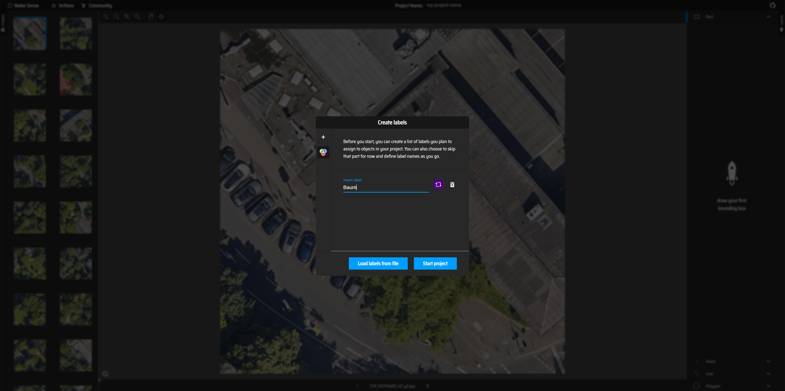
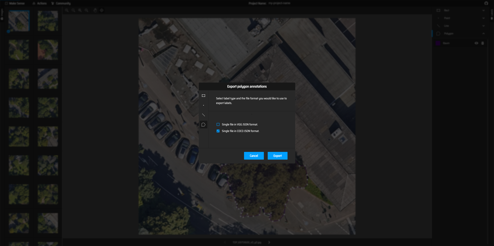
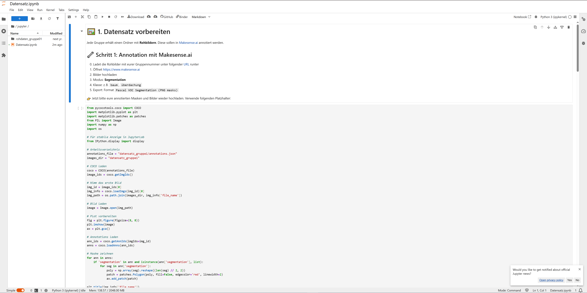

# Hackathon-Bonn
Hackathon der Stadt Bonn zum Thema Verschattung und KI

## Download Datensatz
Rohdaten Downloadlink:   

<a href="[https://example.com](https://databox.bonn.de/public/download-shares/dr8cSb7ya2YRucGC4c6qBQsHu75S5CU0)" target="_blank">Beispiel-Link</a>

Gruppe 01 [Klick](https://databox.bonn.de/public/download-shares/dr8cSb7ya2YRucGC4c6qBQsHu75S5CU0)   
Gruppe 02 [Klick](https://databox.bonn.de/public/download-shares/u9C2wKErUTTs3QAZ043EHVkSwbfJVK7e)   
Gruppe 03 [Klick](https://databox.bonn.de/public/download-shares/voPvvwoOX6r0knp9DZGoN4dWva1oeGaC)   
Gruppe 04 [Klick](https://databox.bonn.de/public/download-shares/YoFK45Xc99zAw1elNJMj9G2vlLeoAMY8)  
Gruppe 05 [Klick](https://databox.bonn.de/public/download-shares/frEqVE6ppREuyVcM9jRZ7ND4yFMJnHsB)  
Gruppe 06 [Klick](https://databox.bonn.de/public/download-shares/k8mSgeYbXo0IeP2j8eGYoJknFKPPFzNR)  

Nach dem Download entpacken und auf Makesense hochladen. Dafür [Makesense.ai](https://www.makesense.ai/) öffnen, rechts unten auf "Get Started" klicken und die Bilder per Drag and Drop hochladen. Nach dem Hochladen "Object Detection" auswählen.  
Daraufhin wird das Label für die Klasse erstellt mit Klick auf das Plus Symbol, auf die wir uns geeinigt haben Bspw: Baum, Mauer, Haus:  
  
Um die gewählte Klasse an Objekten auf dem Bild annotieren zu können, benötigen wir das Polygon-Tool, das rechts unten ausgewählt werden kann. Nun kann das Objekt per Mausklick an den Außenkanten umradnet werden. Sobald das Objekt umrandet wurde, wird das Label ausgewählt:
  
Wichtig! Das annotieren der Bilder muss sorgfältig erfolgen. Es müssen alle Objekte der gewünschten Klasse auf dem Bild annotiert werden, bevor das nächste Bild annotiert wird.
Sobald die Zeit für das Annotierern abgelaufen ist, wird der Annotationsfile heruntergeladen. Dies ist über "Actions" links oben und anschließend "Export Annotations" möglich. In dem neuen Fenster wählen wir "Single File in COCO JSON Format" aus und downloaden den Annotationsfile mit "Export":
 
Nun wird der Datensatz aufgearbeitet. Dafür kopieren wir den Annotationsfile in unseren Datensatzordner. Hier müssen nun alle Bilder gelöscht werden, die nicht annotiert wurden. Der Annotationsfile kann mit einem Texteditior geöffnet werden. Darin findet man die Namen der Bilder, die annotiert wurden.  
Ist der Ordner mit den Annotierten Bildern sauber aufgearbeitet können wir in Jupyter mit der Augmentation fortfahren: [Jupyter](https://hub.gesis.mybinder.org/user/mrzinken-hackathon-bonn-aevnz7mg/doc/tree/jupyter/Datensatz.ipynb)  
Dort wird der Reiter mit Ordnern links oben geöffnet und unser Datensatzordner mittels Drag and Drop abgelegt:  
 

## Binder neu Aufsetzen
Dauert einige Minuten
[Klick](https://mybinder.org/v2/gh/MrZinken/Hackathon-Bonn/HEAD?labpath=jupyter%2FDatensatz.ipynb)

## Lizenz

Dieses Projekt steht unter der [CC BY-NC 4.0 Lizenz](https://creativecommons.org/licenses/by-nc/4.0/).  
Kommerzielle Nutzung ist **nicht gestattet**. Bei Fragen bitte Kontakt aufnehmen.
